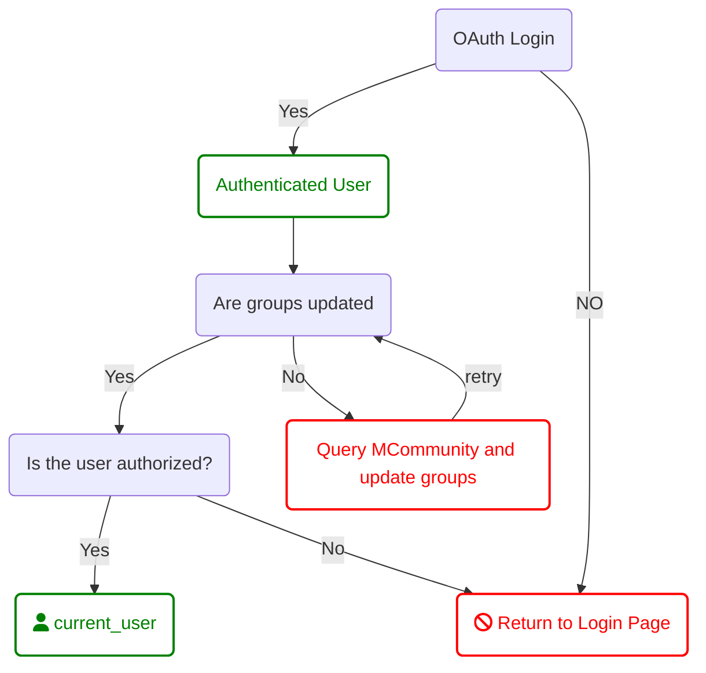

### [Home](./README.md)

## MCommunity:

We leverage MCommunity to allow our users to manage access to our apps. 

When a user logs in to the application, it triggers a background job that queries MCommunity for the user's groups (both owned and members). The user's groups are stored in an array in the user table to perserve performance of the application. 

> Privacy Concern: The groups array should be stored in an encrypted field.

When a new application is created, MCommunity groups need to be created to support it. Every application has the following groups at a minimum;

appname_staging
appname_production
appname_project_leads

