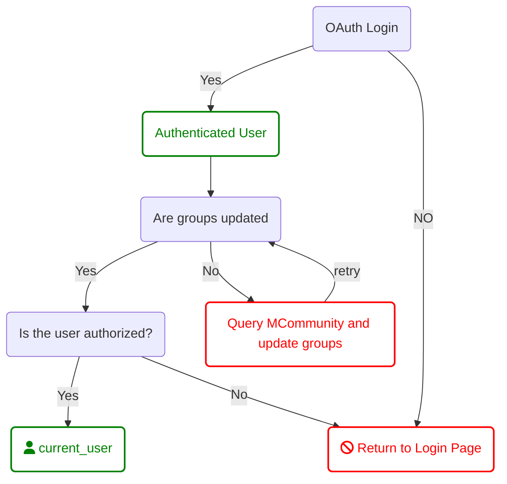

### [Home](./README.md) / [Accounts](./Multitenancy_Accounts.md)

## MCommunity:

We leverage MCommunity to allow our users to manage access to our apps. A MCommunity Account can be thought of a Team account that leverages MCommunity, the University of Michigan's identity management system to manage membership.

When an MCommunity Account is created, it launches a background job to query MCommunity for the name of that group and then collects the members of that group and their roles. This information is stored in a separate table and loaded when the account is accessed**. 

> ** This is done in a background job to avoid making the user wait on logging in. The user may need to refresh thier page if the process hangs for more than a few seconds. In most circumstances the user will not notice an impact. *** This might be able to be obviated utilizing Hotwire.

> Before an MCommunity Account is created in the system we need to verify
  - the MCommunity group exists.
  - the user creating the MCommunity account in our system is an 'owner' of that mCommunity group OR another one of the following .
    - Application owner
    - Application maintainer
    - Department

When a user logs in to their personal account we set the current_user to that account and load the account_users, account_roles and account_types for that user.

```
current_user = User.includes(:account_users, :account_roles, account_types).where(username: "user:")
```

When a user logs in to the application, it triggers a background job that queries MCommunity for the user's groups (both owned and members). The user's groups are stored in an array in the user table to perserve performance of the application. 

> Privacy Concern: The groups array should be stored in an encrypted field.

## Default Application Accounts - MCommunity
When a new application is created, MCommunity groups need to be created to support it. Every application has the following groups by default;

Administrative Groups:

- **app_name_developers**: points to the devlopment team working on the project. (By default will be MCommunity group for Rails Team (lsa-was-rails-devs) or .Net team)
- **appname_project_leads:**
  - includes the project owners/sponsers
- **team_wads_leadership:**
  > ** The 'team_wads_leadership' MUST be included in all applications as a fallback to allow administrative access to applications in the event that users accidentally remove their groups through MCommunity.




